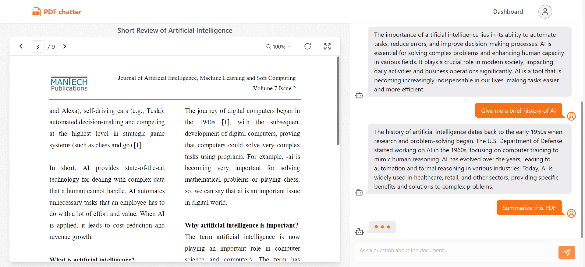
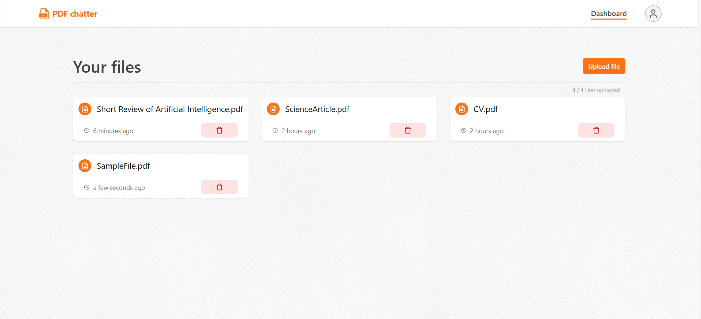
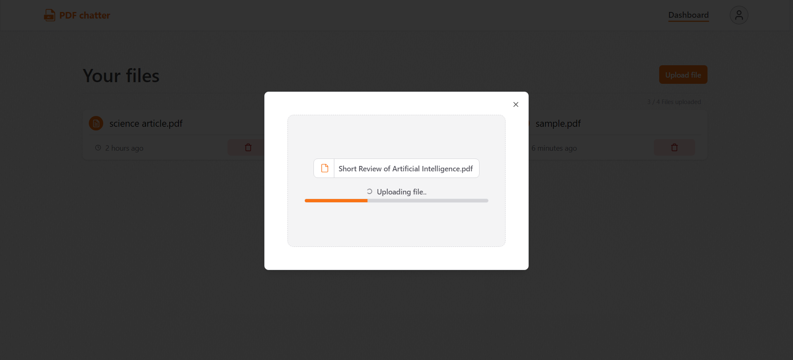

# PDF chatter

Deployed app: https://pdf-chatter-ivory.vercel.app

## Description

Next.js application where you can create your account, upload a PDF file and talk to AI about the file's content.
Upon upload, files are vectorized and stored in a particular namespace on Pinecone which is identical to file's id, every message is doing a similarity search against the vector database namespace, where 4 most similar vectors (pages) are retrieved. Retrieved vectors serve as a context, together with few previous messages and specific instructions template to answer the user's question through OpenAI's GPT-3.5-turbo model.

## Technologies

- Next.js 14
- Typescript
- Prisma
- TRPC
- Tailwind
- Shadcn
- Langchain

## External providers

- Vercel
- Uploadthing
- OpenAI
- Pinecone
- KindeAuth
